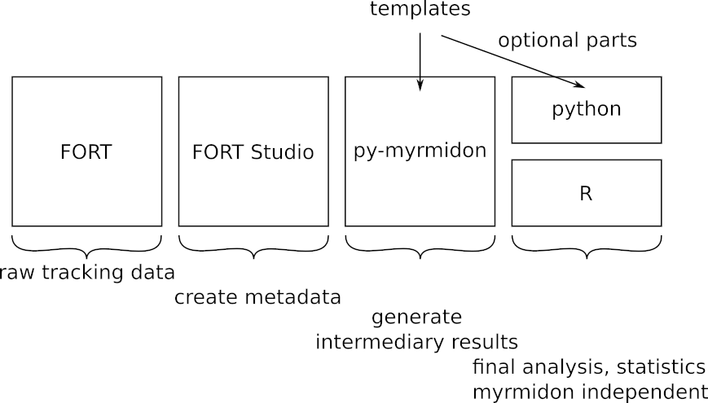

# data-analysis-templates
This repository contains a collection of standard data analysis scripts using py-myrmidon and is intended as a starting point for users without a profound knowledge of python and as a collection of best practice examples. The scripts show sample usages of the ```py-myrmidon``` library and some additional tools. The ```py-myrmidon``` documentation is located [here](https://formicidae-tracker.github.io/myrmidon). All scripts require preprocessed tracking data, i.e. the output of ```Fort Studio```.  
Each notebook has a first part in which standard intermediary data is produced, such as interaction network graph edgelists or spatial fidelity maps. This data is typically lightweight and can be exported, e.g. in csv format, for the use with other, myrmidon independent software. Alternatively, it can be further analyzed in python as outlined in the optional parts of the notebooks.

